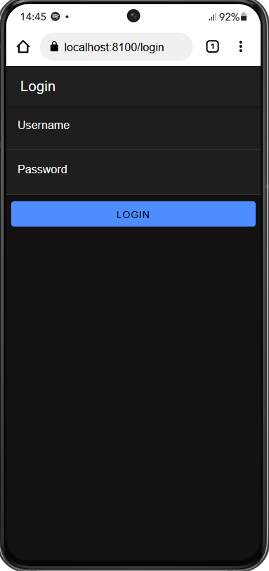
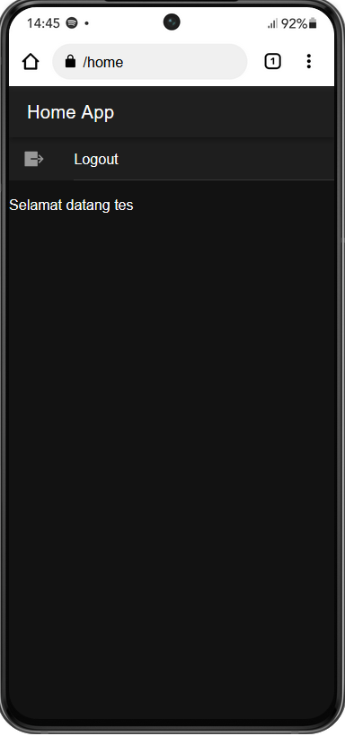

    Nama       : Zaki Jamali Arafi

    NIM        : H1D022048

    Shift Baru : D

# Tugas 7 - Pertemuan 8
## Cara Kerja Login

### 1. Input Pengguna 
Pengguna memasukkan username dan password pada halaman login yang diimplementasikan di login.page.ts.

### 2. Validasi Input
Pada metode login di kelas LoginPage, input pengguna divalidasi untuk memastikan bahwa username dan password tidak kosong.

### 3.Mengirim Permintaan Login
Jika validasi berhasil, data login dikemas dalam objek data dan dikirim ke server menggunakan metode postMethod dari AuthenticationService.

### 4. Menangani Respons Server
- Jika respons server menunjukkan bahwa login berhasil (res.status_login == "berhasil"), token dan nama pengguna disimpan menggunakan metode saveData dari AuthenticationService. Kemudian, pengguna diarahkan ke halaman home (/home).
- Jika login gagal, pesan notifikasi ditampilkan menggunakan metode notifikasi dari AuthenticationService.

### 5. Menyimpan Data Autentikasi
Metode saveData menyimpan token dan nama pengguna ke dalam penyimpanan lokal menggunakan Preferences dari @capacitor/preferences dan memperbarui status autentikasi.

### 6. Navigasi
Setelah login berhasil, pengguna diarahkan ke halaman home menggunakan Router.

## Screenshot

### Login Page

### Home Page
